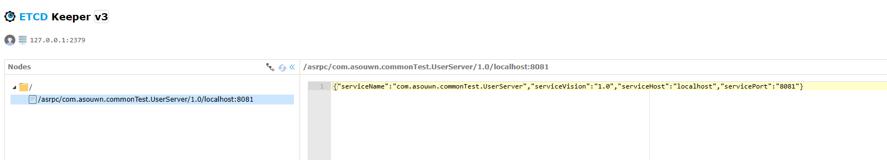

# AsRpc
## SPI
- [知乎《深入理解Java中的SPI机制》]<https://zhuanlan.zhihu.com/p/84337883>
- [简书《高级开发必须理解的Java中SPI机制》]<https://www.jianshu.com/p/46b42f7f593c>
- [反射机制中，new与newInstance的区分]<https://blog.csdn.net/luckykapok918/article/details/50186797>
-  项目中使用到了自定义的SPILoader，方便项目的扩展与管理，实现功能上的热插拔，同时也弥补了SPI不够灵活的缺点，同样也可以使用基于Dubbo实现的SPI机制。
## ETCD配置中心，服务注册与发现
- [etcd 服务注册与发现]<https://www.bilibili.com/video/BV1yC4y1G7aA/?share_source=copy_web&vd_source=53d795644c8c426dc6768f7e3f9d188d>
- 服务注册与发现中心其实本质上就是数据库，服务端将自己的服务的访问信息存在其中，客户端得到访问信息后进行访问，主要目的是为了解决客户端硬编码的问题。同样，用服务发现的方式，可以将服务部署在不同的服务器上，实现服务的分离，避免事故导致所以服务下线。
- 